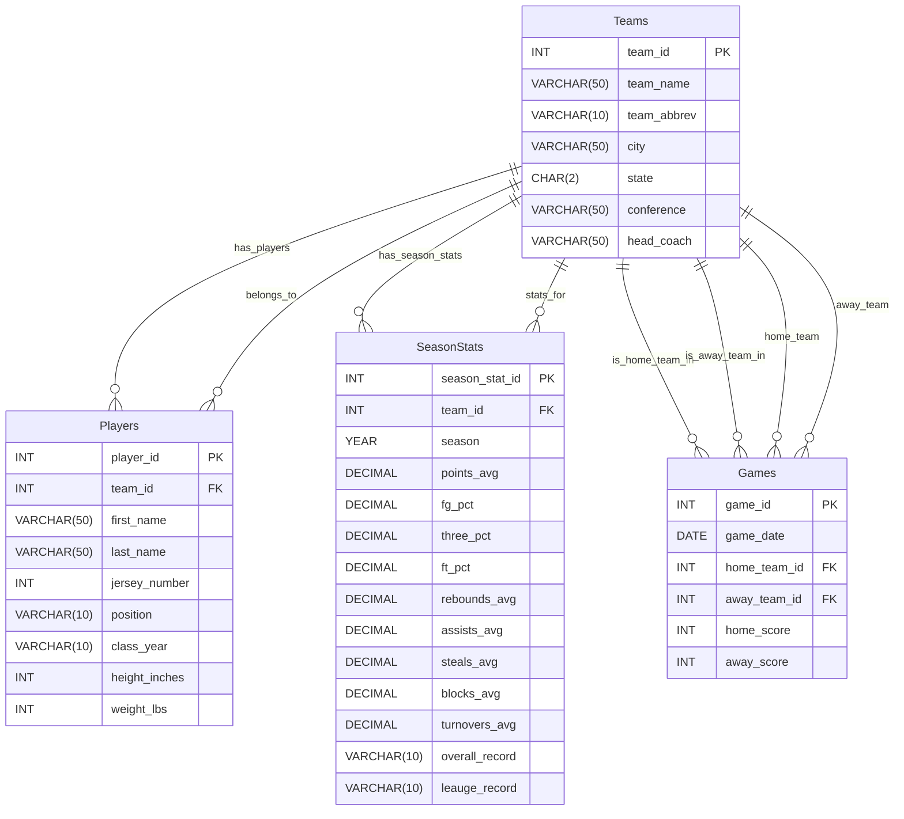

# CS415 Database Project

## Database Summary Report

### Project Overview

This database is designed to model NAIA college basketball teams and show how each team progresses over multiple games, seasons, and rosters. 
The system is organized into four tables: `Teams`, `Players`, `Games`, and `SeasonStats`. Each table stores a small section of data specific to their team. 
Teams represents NAIA college mens basketball teams; Players represents everyone on the teams roster; Games show the results of each head to head matchup;
and SeasonStats shows each teams preformance in different statistical categories over a season. 

I used a fully normalized structure so that each table is stored without repetitive data. Since I decided to not store player names or team names in my Games and SeasonStats tables, 
I was able to reference my data through a forigen key. This made accessing my data a lot easier. It also allowed changes to be a lot easier because I only had to make them in one spot istead of multiple spots. 
For example, last year, Huntington University's head coach was Kory Alford. Since we got a new coach this year, the data would only need to be changed in one spot. 

Another design choice I made was to make a SeasonStats table instead of a TeamStats table. I originally did this and then shortly realized this would require a lot of data. If I were to do this for every team in my database I would have needed to enter over 2400 TeamStats in. 
SeasonStats allows for you to get a glimpse into how the team did over the season. It may prevent you from getting the full picture but statistics are still an important measure of preformance for teams.

`Teams`stores important informtion about each team that helps distingush it from oter teams. These fields that are stored are school name, abbreviation, location, 

## Database ER Model

