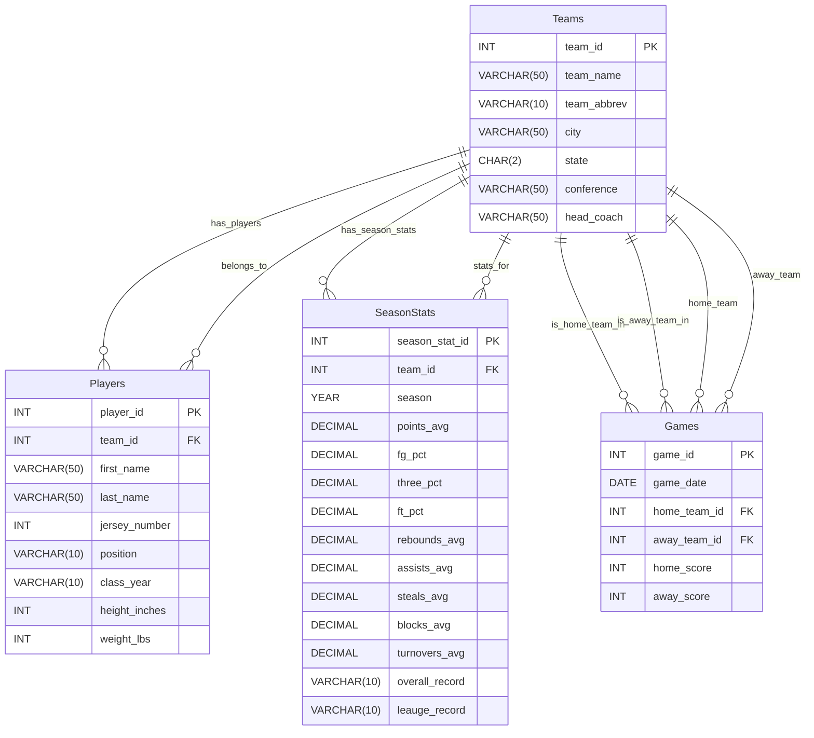

# CS415 Database Project

## Database Summary Report

This database is designed for NAIA men’s basketball coaches, administrators, or anyone who is really interested in the sport. The database allows analyst to track teams and how they progress over a season. It gives a detailed look into the teams, their players, the games they play each season, and a detailed look into their stats for the season. This provides a central system for organizing the database. 

This is also a good database for Teams and head coaches because it allows them to take a deeper dive into the other team players. While it doesn’t have player stats, it does have height and weight information that is important to know. For example, Indiana Wesleyan has a player on their team that is 7’3’ and that would be an important thing to know when getting ready to match up with them. 

From a user’s perspective, the database is designed to be straightforward and easy to use. All the titles are simple and easy to understand allowing you to be able to know what is going on. You can simply look up information though the`Teams` table and explore individual player information through the `Player` table. By using foreign keys, I was able to keep the data consistent instead of having to repeat the data.

The `SeasonStats` table provides a user with an overview of a team’s performance over the course of a season. This doesn’t give information from individual games, but it is still able to capture a large amount of information that the user would find useful for comparing for head-to-head matchups. This is the main way I see a user using this database is through the comparison to get a better idea of which team they think will win. 


### Project Overview

This database is designed to model NAIA college basketball teams and show how each team progresses over multiple games, seasons, and rosters. 
The system is organized into four tables: `Teams`, `Players`, `Games`, and `SeasonStats`. Each table stores a small section of data specific to their team. 
Teams represents NAIA college mens basketball teams; Players represents everyone on the teams roster; Games show the results of each head to head matchup;
and SeasonStats shows each teams preformance in different statistical categories over a season. 

I used a fully normalized structure so that each table is stored without repetitive data. Since I decided to not store player names or team names in my Games and SeasonStats tables, 
I was able to reference my data through a forigen key. This made accessing my data a lot easier. It also allowed changes to be a lot easier because I only had to make them in one spot istead of multiple spots. 
For example, last year, Huntington University's head coach was Kory Alford. Since we got a new coach this year, the data would only need to be changed in one spot. 

Another design choice I made was to make a SeasonStats table instead of a TeamStats table. I originally did this and then shortly realized this would require a lot of data. If I were to do this for every team in my database I would have needed to enter over 2400 TeamStats in. 
SeasonStats allows for you to get a glimpse into how the team did over the season. It may prevent you from getting the full picture but statistics are still an important measure of preformance for teams.

`Teams`stores important informtion about each team that helps distingush it from other teams. These fields that are stored are team name, abbreviation, city, state, conference, and head coach. This table is central to the database as it the main reference table for each of the other tables. Each table links back to the Teams table. 

`Players` stores all information about each member of the team including first name, last name, jersey number, position, class year, height, and weight. Each player is part of one team through the `team_id` foreigen key. This table shows important information about each player that helps show how each team functions. 

`Games` stores data for each game played by the crossroads league teams including the game date, the home team, the away tean, and the final score for eeach team. This table uses forigen keys to reference teams rather than storing each team name. This table is important for tracking outcomes and shows important information on head to head matchups. 

`SeasonStats` stores statistical data for each team to represent their whole season including their average points per game, field goal percentage, three point percentage, free throw percentage, rebounds per game, assists per game, steals per game, blocks per game, turnovers per game, and their overall season record. Each row of data will link a team to a specific season. This table is essential to the analysis because it allows you to compare teams by the numbers so you can get a sense for how good or bad the teams are. 


## Database ER Model



## Create Tables

The following SQL creates the `Teams`,`Players`,`Games`, and `SeasonStats` tables in the current database. 

```sql
-- ==========================================
--TEAMS TABLE
-- Stores information about basketball teams
-- ==========================================

CREATE TABLE Teams (
    team_id INT PRIMARY KEY AUTO_INCREMENT,
    team_name VARCHAR(50),
    team_abbrev VARCHAR(10),
    city VARCHAR(50),
    state CHAR(2),
    conference VARCHAR(50),
    head_coach VARCHAR(50)
);

-- ==========================================
--TEAMS PLAYERS
-- Stores information about a teams roster
-- ==========================================

CREATE TABLE Players (
    player_id INT PRIMARY KEY AUTO_INCREMENT,
    team_id INT,
    first_name VARCHAR(50),
    last_name VARCHAR(50),
    jersey_number INT,
    position CHAR(10),
    class_year CHAR(10),
    height_inches INT,
    weight_lbs INT, 
    FOREIGN KEY (team_id) REFERENCES Teams(team_id)
);

-- ===========================================
--GAMES TABLES
-- Stores head to head matchups between teams
-- ===========================================

CREATE TABLE Games (
    game_id INT PRIMARY KEY AUTO_INCREMENT,
    game_date DATE NOT NULL,
    home_team_id INT NOT NULL,
    away_team_id INT NOT NULL,
    home_score INT NOT NULL,
    away_score INT NOT NULL,
    FOREIGN KEY (home_team_id) REFERENCES Teams(team_id)
);


-- ====================================================
--SEASONSTATS TABLES
-- Stores statistics about teams and their preformance
-- ====================================================

CREATE TABLE SeasonStats (
    season_stat_id INT AUTO_INCREMENT PRIMARY KEY,
    team_id INT NOT NULL,
    season VARCHAR(10) NOT NULL,
    points_avg DECIMAL(5,2),
    fg_pct DECIMAL(5,3),
    three_pct DECIMAL(5,3),
    ft_pct DECIMAL(5,3),
    rebounds_avg DECIMAL(5,2),
    assists_avg DECIMAL(5,2),
    steals_avg DECIMAL(5,2),
    blocks_avg DECIMAL(5,2),
    turnovers_avg DECIMAL(5,2),
    overall_record VARCHAR(10),
    league_record VARCHAR(10),
    FOREIGN KEY (team_id) REFERENCES Teams(team_id)
);

```
---

### Insert Data

The following SQL inserts sample data for the `Teams` (x72), `Players` (x144), `Games` (x211), `SeasonStats` (x10) tables into the current database. 

```sql
--------------------------------------------------------
-- TEAMS SAMPLE DATA (72 rows)
--------------------------------------------------------
INSERT INTO Teams (team_name, team_abbrev, head_coach, city, state, conference)
VALUES
('Huntington University', 'HU', 'Kory Alford', 'Huntington', 'IN', 'Crossroads League'),
('Indiana Wesleyan University', 'IWU', 'Greg Tonega', 'Marion', 'IN', 'Crossroads League'),
('Bethel University', 'BU', 'Steve Drabyn', 'Mishawaka', 'IN', 'Crossroads League'),
('University of Saint Francis', 'USF', 'Chad LaCross', 'Fort Wayne', 'IN', 'Crossroads League'),
('Goshen College', 'GC', 'Kyle Capps', 'Goshen', 'IN', 'Crossroads League'),
('Grace College', 'GC', 'Scott Moore', 'Winona Lake', 'IN', 'Crossroads League'),
('Mount Vernon Nazarene University', 'MVNU', 'Jared Ronai', 'Mount Vernon', 'OH', 'Crossroads League'),
('Spring Arbor University', 'SAU', 'Ryan Cottingham', 'Spring Arbor', 'MI', 'Crossroads League'),
('Taylor University', 'TU', 'Austin Peters', 'Upland', 'IN', 'Crossroads League'),
('Marian University', 'MU', 'Pat Knight', 'Indianapolis', 'IN', 'Crossroads League'),
('Madonna University', 'MU', 'Noel Emenhiser', 'Livonia', 'MI', 'Wolverine-Hoosier Athletic Conference'),
('Indiana Institute of Technology', 'IT', 'Ted Albert', 'Fort Wayne', 'IN', 'Wolverine-Hoosier Athletic Conference'),
('Cornerstone University', 'CU', 'Kim Elders', 'Grand Rapids', 'MI', 'Wolverine-Hoosier Athletic Conference'),
('University of Michigan-Dearborn', 'MU', 'Mo Bazzi', 'Dearborn', 'MI', 'Wolverine-Hoosier Athletic Conference'),
('University of Pikeville', 'UPIKE', 'Tigh Compton', 'Pikeville', 'KY', 'Appalachian Athletic Conference'),
('University of Rio Grande', 'URG', 'Ryan Arrowood', 'Rio Grande', 'OH', 'River States Conference'),
('Georgetown College', 'GC', 'Ed Cooley', 'Georgetown', 'KY', 'Mid-South Conference'),
('University of Northwestern Ohio', 'UNOH', 'Richard Westerlund', 'Lima', 'OH', 'Wolverine-Hoosier Athletic Conference'),
('Olivet Nazarene University', 'ONU', 'Nick Birkey', 'Bourbonnais', 'IL', 'Chicagoland Collegiate Athletic Conference'),
('Holy Cross College', 'HCC', 'Tyler Braidic', 'Notre Dame', 'IN', 'Chicagoland Collegiate Athletic Conference'),    
('East-West University', 'EWU', 'Tommie Posley', 'Chicago', 'IL', 'Chicagoland Collegiate Athletic Conference'),
('Indiana University Columbus', 'IUC', 'Eric Jackson', 'Columbus', 'IN', 'River States Conference'),
('Milligan University', 'MU', 'Bill Robinson', 'Milligan', 'TN', 'Appalachian Athletic Conference'),
('Lawrence Technological University', 'LTU', 'Josh Pickens', 'Southfield', 'MI', 'Wolverine-Hoosier Athletic Conference'),
('New College of Florida', 'NCF', 'Andrew Wingreen', 'Sarasota', 'FL', 'Sun Conference'),
('Ave Maria University', 'AMU', 'Jamal Smith', 'Ave Maria', 'FL', 'Sun Conference'),
('Lourdes University', 'LU', 'Dennis Hopson', 'Sylvania', 'OH', 'Wolverine-Hoosier Athletic Conference'),
('Northwestern College', 'NWC', 'Kris Korver', 'Orange city', 'IA', 'Great Plains Athletic Conference'),
('MidAmerica Nazarene University', 'MNU', 'Adam Hepker', 'Olathe', 'KS', 'Heart of America Athletic Conference'),
('Grand View University', 'GVU', 'Denis Schaefer', 'Des Moines', 'IA', 'Heart of America Athletic Conference'),
('Trinity Christian College', 'TCC', 'David Osborn', 'Palos Heights', 'IL', 'Chicagoland Collegiate Athletic Conference'),
('Florida Memorial University', 'FMU', 'Joshua Mendoza', 'Miami Gardens', 'FL', 'Sun Conference'),
('St. Thomas University', 'STU', 'Josh Tauer', 'Miami Gardens', 'FL', 'Sun Conference'),
('Life University', 'LU', 'Kevin Easley', 'Marietta', 'GA', 'Southern States Athletic Conference'),
('Governors State University', 'GSU', 'Tony Bates', 'University Park', 'IL', 'Chicagoland Collegiate Athletic Conference'),
('Indiana University South Bend', 'IUSB', 'Scott Cooper', 'South Bend', 'IN', 'Chicagoland Collegiate Athletic Conference'),
('Cumberland University', 'CU', 'Eric Evans II', 'Lebanon', 'TN', 'Mid-South Conference'),
('Peru State College', 'PSC', 'Roman Gentry', 'Peru', 'NE', 'Heart of America Athletic Conference'),
('Morningside University', 'MU', 'Trent Miller', 'Sioux City', 'IA', 'Great Plains Athletic Conference'),
('LSU Alexandria', 'LSUA', 'Dimario Jackson', 'Alexandria', 'LA', 'Red River Athletic Conference'),
('Rochester Christian University', 'RCU', 'Klint Pleasant', 'Rochester Hills', 'MI', 'Wolverine-Hoosier Athletic Conference'),
('Cleary University', 'CU', 'Carl Thomas', 'Howell', 'MI', 'Wolverine-Hoosier Athletic Conference'),
('Lewis-Clark State College', 'LCSC', 'Austin Johnson', 'Lewiston', 'ID', 'Cascade Collegiate Conference'),
('Concordia University', 'CU', 'Ricky Yahn', 'Ann Arbor', 'MI', 'Wolverine-Hoosier Athletic Conference'),
('Kuyper College', 'KC', 'Gary Bailey', 'Grand Rapids', 'MI', 'National Christian College Athletic Association'),
('Defiance College', 'DC', 'Josh Gibson', 'Defiance', 'OH', 'Heartland Collegiate Athletic Conference'),
('Midway University', 'MU', 'Akeem Scott', 'Midway', 'KY', 'River States Conference'),
('Aquinas College', 'AQ', 'Ryan Bertoia', 'Grand Rapids', 'MI', 'Wolverine-Hoosier Athletic Conference'),
('University of St. Francis', 'USF-IL', 'Ryan Marks', 'Joliet', 'IL', 'Chicagoland Collegiate Athletic Conference'),
('Saint Xavier University', 'SXU', 'Robert Ford', 'Chicago', 'IL', 'Chicagoland Collegiate Athletic Conference'),
('Indiana University East', 'IUE', 'Mark Hester', 'Richmond', 'IN', 'River States Conference'),
('Texas A&M University-San Antonio', 'TAMUSA', 'Chris Dial', 'San Antonio', 'TX', 'Red River Athletic Conference'),
('Nelson University', 'NU', 'Delton Deal', 'Waxahachie', 'TX', 'Sooner Athletic Conference'),
('Carolina University', 'CU', 'Jacob Heck', 'Winston-Salem', 'NC', 'NCCAA'),
('Saint Mary-of-the-Woods College', 'SMWC', 'Maverick Harris', 'Saint Mary of the Woods', 'IN', 'River States Conference'),
('Arizona Christian University', 'ACU', 'Jeff Rutter', 'Glendale', 'AZ', 'Golden State Athletic Conference'),
('Campbellsville University', 'CU', 'Brent Vernon', 'Campbellsville', 'KY', 'Mid-South Conference'),
('Pacific Union College', 'PUC', 'Landon Banks', 'Angwin', 'CA', 'California Pacific Conference'),
('Califorinia State Maritime Academy', 'CSMA', 'Colin Johnson', 'Vallejo', 'CA', 'California Pacific Conference'),
('Simpson University', 'SU', 'David Cone', 'Redding', 'CA', 'California Pacific Conference'),
('Grace Christian University', 'GCU', 'Ryan Krombeen', 'Grand Rapids', 'MI', 'NCCAA'),
('Great Lakes Christian College', 'GLCC', 'Elijah Kess', 'Lansing', 'MI', 'NCCAA'),
('Siena Heights University', 'SHU', 'Joe Pechota', 'Adrian', 'MI', 'Wolverine-Hoosier Athletic Conference'),
('Freed-Hardeman University', 'FHU', 'Drew Stutts', 'Henderson', 'TN', 'Mid-South Conference'),
('La Sierra University', 'LSU', 'Ethan Lowe', 'Riverside', 'CA', 'California Pacific Conference'),
('Justice College', 'JC', 'BJ Letcher', 'Chandler', 'AZ', 'National Christian College Athletic Association'),
('Adrian College', 'AC', 'Tim Kaiser', 'Adrian', 'MI', 'Michigan Intercollegiate Athletic Association'),
('Indiana University Kokomo', 'IUK', 'Eric Echelbarger', 'Kokomo', 'IN', 'River States Conference'),
('Ohio Christian University', 'OCU', 'Ron Miller', 'Circleville', 'OH', 'River States Conference'),
('Moody Bible Institute', 'MBI', 'Michael Chapin', 'Chicago', 'IL', 'National Christian College Athletic Association'),
('Indiana University Southeast', 'IUSE', 'Wiley Brown', 'New Albany', 'IN', 'River States Conference'),
('Judson University', 'JU', 'Rick Williams', 'Elgin', 'IL', 'Chicagoland Collegiate Athletic Conference'),
('Roosevelt University', 'RU', 'Dee Brown', 'Chicago', 'IL', 'Chicagoland Collegiate Athletic Conference');

--------------------------------------------------------
-- PLAYERS SAMPLE DATA (144 rows)
--------------------------------------------------------
INSERT INTO Players (team_id, first_name, last_name, jersey_number, position, class_year, height_inches, weight_lbs)
VALUES
(1, 'Kaden', 'Johnson', 1, 'F', 'JR', 83, 200),
(1, 'Maximus', 'Gizzi', 2, 'G', 'GR', 73, 185),
(1, 'Cade', 'Brenner', 3, 'G', 'SO', 75, 190),
(1, 'Taden', 'Metzger', 4, 'G', 'FR', 74, 175),
(1, 'Drew', 'Goodline', 5, 'G', 'SR', 74, 165),
(1, 'Khamani', 'Smith', 10, 'F', 'SR', 77, 200),
(1, 'Romain', 'Bruwier', 11, 'F', 'SR', 81, 220),
(1, 'Miles', 'Good', 12, 'G', 'FR', 72, 165),
(1, 'Landon', 'Biegel', 15, 'F', 'SO', 77, 180),
(1, 'Lane', 'Sparks', 20, 'G', 'SR', 75, 185),
(1, 'Landen', 'Jordan', 23, 'F', 'SR', 81, 210),
(1, 'Jackson', 'Paul', 24, 'G', 'SR', 73, 175),
(1, 'Luke', 'LaGrange', 41, 'F', 'JR', 77, 195),
    
(2, 'DJ', 'Moore', 0, 'F', 'JR', 80, 190),
(2, 'Bright', 'Kari', 1, 'G', 'JR', 83, 210),
(2, 'Kyle', 'Sanders', 2, 'G', 'SR', 73, 190),
(2, 'Rocco', 'Muratori', 8, 'C', 'SO', 87, 255),
(2, 'Jaxson', 'Gould', 10, 'G', 'SO', 73, 190),
(2, 'Matthew', 'Brown', 11, 'F', 'SO', 78, 215),
(2, 'Peyton', 'Byrd', 13, 'F', 'FR', 73, 190),
(2, 'Connor', 'Hussong', 14, 'G', 'SO', 75, 150),
(2, 'Issac', 'Andrews', 20, 'G', 'FR', 73, 185),
(2, 'Griffin', 'Kliewer', 21, 'G', 'SR', 75, 190),
(2, 'Jake', 'Smith', 23, 'F', 'FR', 78, 215),
(2, 'Luke', 'Brown', 25, 'G', 'JR', 73, 175),
(2, 'Marcus', 'Ankney', 30, 'G', 'SO', 75, 185),
(2, 'Cliff', 'Gashumba', 33, 'F', 'SO', 78, 200),
(2, 'Caedmon', 'Bontrager', 35, 'F', 'SO', 79, 235),
    
(3, 'Payton', 'Baird', 0, 'G', 'FR', 77, 185),
(3, 'Jameir', 'Jefferson', 1, 'G', 'SO', 74, 180),
(3, 'Colin', 'Comer', 3, 'G', 'RS', 76, 185),
(3, 'Beau', 'Jacquay', 4, 'C', 'SO', 80, 210),
(3, 'Austin', 'Cripe', 5, 'G', 'RS', 75, 170),
(3, 'Andrew', 'Hedrick', 10, 'G', 'SO', 72, 185),
(3, 'Alex', 'Johnson', 13, 'G', 'FR', 76, 180),
(3, 'James', 'Anserson', 14, 'C', 'GR', 80, 220),
(3, 'Trent', 'Edwards', 21, 'G', 'GR', 76, 180),
(3, 'Alonas', 'Peciulis', 22, 'F', 'JR', 78, 220),
(3, 'Preston', 'Phillips', 23, 'F', 'GR', 80, 235),
(3, 'Luke', 'McBride', 24, 'G', 'SO', 73, 205),
(3, 'Ike', 'Umeh', 25, 'C', 'GR', 78, 210),
(3, 'Alex', 'Ellenson', 32, 'F', 'RS', 80, 195),
    
(4, 'Keshawn', 'McNeill', 0, 'G', 'SO', 74, 190),
(4, 'Branden', 'Northern', 2, 'G', 'JR', 72, 215),
(4, 'Joe', 'Reidy', 3, 'F', 'JR', 79, 180),
(4, 'Zane', 'Burke', 4, 'G', 'SR', 76, 190),
(4, 'Robert', 'Fry II', 5, 'G', 'SR', 73, 185),
(4, 'Luke', 'Almodovar', 10, 'G', 'SO', 74, 195),
(4, 'Matthew', 'Roettger', 11, 'G', 'FR', 74, 175),
(4, 'Eugene', 'Young Jr.', 13, 'G', 'FR', 77, 180),
(4, 'Chase', 'Newton', 14, 'G', 'SO', 73, 190),
(4, 'Sam', 'Johnson', 15, 'G', 'FR', 74, 185),
(4, 'Braeden', 'Messenger', 20, 'F', 'FR', 76, 195),
(4, 'Karson', 'Rogers', 21, 'F', 'FR', 78, 200),
(4, 'Jackson', 'Gowdy', 22, 'F', 'SR', 80, 215),
(4, 'Dorean', 'Hacker', 23, 'F', 'FR', 76, 205),
(4, 'Isaiah', 'Malone', 32, 'F', 'SO', 80, 220),
    
(5, 'DJ', 'Bryant', 2, 'G', 'GR', 69, 170),
(5, 'Judah', 'Simfukwe', 5, 'G', 'JR', 73, 180),
(5, 'Baran', 'Aslan', 11, 'G', 'SO', 75, 185),
(5, 'Richard', 'Wilson', 12, 'G', 'GR', 75, 190),
(5, 'Jacob', 'Carlson', 13, 'G', 'JR', 75, 180),
(5, 'Braden', 'Allen', 14, 'F', 'SO', 74, 195),
(5, 'Kevin', 'Cota', 15, 'F', 'SO', 78, 215),
(5, 'Deecon', 'Hill', 20, 'G', 'SO', 76, 195),
(5, 'Saiveon', 'Williams', 21, 'F', 'JR', 77, 210),
(5, 'Marcus', 'Northern', 23, 'G', 'SO', 72, 175),
(5, 'Kahmi', 'Bracey', 30, 'G', 'SO', 71, 170),
(5, 'Jacob', 'Eyler', 31, 'G', 'JR', 71, 175),
(5, 'Juraj', 'Minarovjech', 34, 'F', 'SO', 77, 220),
(5, 'JP', 'Jabbour', 50, 'C', 'JR', 77, 240),
(5, 'Kenny', 'May', 55, 'F', 'FR', 76, 205),
    
(6, 'Carter', 'Stoltzfus', 2, 'G', 'SR', 72, 175),
(6, 'Alex', 'Darnell', 3, 'G', 'SR', 73, 180),
(6, 'Cannen', 'Houser', 10, 'G', 'FR', 77, 205),
(6, 'Marcus', 'Davidson', 11, 'G', 'SR', 73, 180),
(6, 'Ian', 'Raasch', 12, 'F', 'SO', 78, 215),
(6, 'Justin', 'DeGraaf', 13, 'F', 'SR', 79, 225),
(6, 'Isaac', 'Schultz', 15, 'F', 'FR', 79, 220),
(6, 'Hunter', 'Walston', 20, 'F', 'FR', 79, 230),
(6, 'Caleb', 'Herrold', 21, 'G', 'SO', 77, 200),
(6, 'Brycen', 'Graber', 22, 'G', 'SR', 75, 185),
(6, 'Ian', 'Scott', 23, 'F', 'SR', 79, 225),
(6, 'Brett', 'Sickafoose', 24, 'G', 'SR', 74, 180), 
(6, 'Seth', 'Martin', 25, 'G', 'SO', 74, 185),
(6, 'Gage', 'Sefton', 30, 'G', 'SO', 77, 205),
(6, 'Cole', 'Hayworth', 32, 'F', 'FR', 78, 215),

(7, 'Milton', 'Gage', 0, 'G', 'GR', 71, 170),
(7, 'Bede', 'Lori', 1, 'G', 'RS', 75, 185),
(7, 'Peyton', 'Heiss', 2, 'G', 'FR', 76, 195),
(7, 'Isaiah', 'Brown', 3, 'F', 'FR', 78, 215),
(7, 'Drew', 'Koning', 4, 'G', 'RS', 75, 185),
(7, 'Grant', 'Burkholder', 5, 'G', 'SO', 69, 165),
(7, 'Caleb', 'Schall', 10, 'G', 'SR', 70, 170),
(7, 'Trent', 'Koning', 11, 'G', 'JR', 73, 180),
(7, 'Mason', 'Harvey', 20, 'F', 'FR', 80, 235),
(7, 'Junior', 'Kambomba', 23, 'G', 'FR', 75, 190),
(7, 'Bailey', 'Conrad', 32, 'F', 'GR', 79, 225),
(7, 'Carter', 'Jones', 34, 'G/F', 'SR', 77, 205),
(7, 'Devin', 'Dreier', 40, 'F', 'SO', 79, 230),

(8, 'Fletcher', 'Manhart', 0, 'G', 'SR', 71, 190),
(8, 'David', 'Cundiff', 1, 'G', 'FR', 72, 170),
(8, 'Travis', 'Grayson', 2, 'G', 'JR', 75, 195),
(8, 'Shane', 'Rykse', 3, 'G', 'FR', 75, 190),
(8, 'Tyler', 'DeSimpelare', 4, 'G', 'JR', 75, 165),
(8, 'Warrick', 'Elder', 5, 'G', 'FR', 73, 165),
(8, 'Trey', 'Cottingham', 10, 'G', 'SR', 73, 180),
(8, 'Eli', 'White', 11, 'G', 'JR', 75, 190),
(8, 'Aden', 'Zank', 15, 'F', 'JR', 78, 200),
(8, 'Luke', 'Stuckey', 20, 'G', 'SO', 75, 185),
(8, 'Ty', 'Rykse', 21, 'F', 'JR', 79, 225),
(8, 'Jayden', 'Nimako', 22, 'F', 'FR', 78, 200),
(8, 'Kevyn', 'Robertson', 23, 'F', 'SR', 78, 205),
(8, 'Dante', 'Favor', 24, 'F', 'SO', 80, 215),
(8, 'Gabe', 'Newhof', 25, 'F', 'JR', 81, 225),

(9, 'Chaz', 'Harvey', 0, 'G', 'JR', 73, 185),
(9, 'Anton', 'Webb', 1, 'F', 'SR', 80, 210),
(9, 'Jackson', 'Ullom', 2, 'G', 'JR', 70, 180),
(9, 'Nate', 'Paarlberg', 3, 'F', 'JR', 78, 190),
(9, 'Kobe', 'Funderburk', 4, 'G', 'SR', 72, 170),
(9, 'Joey', 'Heaston', 10, 'G', 'FR', 74, 175),
(9, 'Ben', 'Michel', 12, 'F', 'JR', 78, 205),
(9, 'Levin', 'Smith', 13, 'C', 'FR', 83, 210),
(9, 'John', 'McLimore', 14, 'G', 'JR', 75, 195),
(9, 'Kaden', 'Fuhrmann', 15, 'G', 'SR', 76, 190),
(9, 'Carson', 'Miller', 20, 'G', 'JR', 74, 205),
(9, 'Noah', 'Choi', 21, 'G', 'SO', 73, 185),
(9, 'Izaiah', 'Day', 23, 'G', 'SO', 75, 175),
(9, 'Kaleb', 'Edwards', 24, 'G', 'JR', 75, 175),
(9, 'Caleb', 'Hodgson', 34, 'C', 'SR', 82, 220),
(9, 'Julian', 'Mitchell', 35, 'G', 'SO', 75, 160),
(9, 'Pete', 'Combs', 40, 'F', 'SO', 80, 220),

(10, 'Gus', 'Etchison', 0, 'G', 'SR', 70, 150),
(10, 'Josiah', 'Gustin', 2, 'F', 'FR', 80, 210),
(10, 'Dylan', 'Moles', 3, 'G', 'SO', 75, 190),
(10, 'Gavin', 'Foe', 4, 'G/F', 'RS', 76, 205),
(10, 'Noah', 'Lovan', 11, 'G', 'FR', 75, 185),
(10, 'Reis', 'Butcher', 12, 'G', 'FR', 75, 190),
(10, 'Elhadj', 'Diallo', 13, 'G/F', 'RS', 75, 190),
(10, 'Jackson', 'Ames', 14, 'C', 'SR', 84, 250),
(10, 'Luke', 'Carroll', 20, 'G/F', 'RS', 78, 220),
(10, 'Tillman', 'Etchison', 21, 'G', 'FR', 70, 165),
(10, 'Dominic', 'Bonner', 24, 'G', 'FR', 75, 195),
(10, 'Hayden', 'Nahra', 25, 'G', 'RS', 78, 205),
(10, 'Aidan', 'Franks', 34, 'G', 'RS', 75, 175);

--------------------------------------------------------
-- GAMES SAMPLE DATA (211 rows)
--------------------------------------------------------
INSERT INTO Games (game_date, home_team_id, away_team_id, home_score, away_score)
VALUES

-- Huntington
    
('2024-10-26', 1, 21, 130, 72),
('2024-11-01', 1, 22, 91, 67),
('2024-11-02', 1, 23, 56, 50),
('2024-11-06', 24, 1, 83, 87),
('2024-11-09', 1, 20, 87, 63),
('2024-11-13', 11, 1, 60, 81),
('2024-11-16', 1, 13, 82, 78),
('2024-11-20', 1, 2, 97, 88),
('2024-11-23', 1, 3, 90, 96),
('2024-12-04', 4, 1, 89, 65),
('2024-12-07', 1, 7, 82, 71),
('2024-12-14', 25, 1, 77, 80),
('2024-12-16', 26, 1, 69, 97),
('2024-12-30', 1, 19, 79, 64),
('2025-01-04', 10, 1, 78, 76),
('2025-01-08', 1, 6, 66, 70),
('2025-01-11', 8, 1, 64, 81),
('2025-01-15', 1, 9, 82, 68),
('2025-01-18', 5, 1, 60, 109),
('2025-01-25', 2, 1, 83, 76),
('2025-01-29', 3, 1, 82, 92),
('2025-02-01', 1, 4, 91, 69),
('2025-02-05', 7, 1, 57, 68),
('2025-02-08', 1, 10, 83, 62),
('2025-02-12', 6, 1, 82, 84),
('2025-02-15', 1, 8, 58, 62),
('2025-02-19', 9, 1, 84, 92),
('2025-02-22', 1, 5, 91, 56),
('2025-02-25', 1, 4, 95, 83),
('2025-02-28', 3, 1, 65, 75),
('2025-03-03', 6, 1, 80, 72),
('2025-03-14', 1, 27, 77, 51),
('2025-03-15', 1, 28, 66, 80),

-- IWU

('2024-10-31', 2, 12, 82, 78),
('2024-11-01', 2, 13, 78, 72),
('2024-11-05', 2, 19, 108, 67),
('2024-11-08', 2, 29, 78, 74),
('2024-11-09', 2, 30, 79, 69),
('2024-11-14', 2, 31, 118, 86),
('2024-11-23', 6, 2, 83, 93),
('2024-12-04', 3, 2, 89, 97),
('2024-12-07', 2, 8, 89, 83),
('2024-12-09', 2, 21, 111, 57),
('2024-12-14', 32, 2, 54, 65),
('2024-12-16', 33, 2, 62, 88),
('2024-12-31', 2, 11, 113, 75),
('2025-01-04', 4, 2, 80, 77),
('2025-01-08', 9, 2, 79, 76),
('2025-01-11', 2, 7, 84, 71),
('2025-01-15', 2, 5, 85, 76),
('2025-01-18', 10, 2, 78, 71),
('2025-01-29', 6, 2, 89, 75),
('2025-02-01', 2, 3, 94, 60),
('2025-02-05', 8, 2, 84, 75),
('2025-02-08', 2, 4, 95, 86),
('2025-02-12', 2, 9, 76, 63),
('2025-02-15', 2, 7, 98, 76),
('2025-02-19', 5, 2, 85, 104),
('2025-02-22', 2, 10, 88, 73),
('2025-02-25', 8, 2, 95, 96),
('2025-02-28', 6, 2, 89, 82),
('2025-03-14', 2, 11, 96, 77),
('2025-03-15', 2, 34, 74, 88),

-- Bethel

('2024-10-26', 3, 35, 86, 61),
('2024-11-01', 3, 16, 92, 66),
('2024-11-02', 3, 18, 87, 79),
('2024-11-09', 3, 36, 78, 57),
('2024-11-13', 3, 37, 102, 86),
('2024-11-15', 20, 3, 56, 76),
('2024-11-20', 3, 5, 101, 56),
('2024-11-26', 17, 3, 74, 68),
('2024-12-07', 3, 4, 95, 78),
('2024-12-16', 32, 3, 101, 81),
('2024-12-17', 26, 3, 94, 82),
('2024-12-30', 3, 13, 91, 83),
('2025-01-04', 7, 3, 69, 81),
('2025-01-08', 3, 10, 70, 57),
('2025-01-11', 6, 3, 74, 75),
('2025-01-15', 3, 8, 73, 63),
('2025-01-18', 9, 3, 74, 62),
('2025-01-25', 6, 3, 69, 86),
('2025-02-05', 4, 3, 70, 75),
('2025-02-08', 3, 7, 72, 69),
('2025-02-12', 10, 3, 66, 89),
('2025-02-15', 3, 6, 55, 72),
('2025-02-19', 8, 3, 79, 72),
('2025-02-22', 3, 9, 80, 67),
('2025-02-25', 3, 9, 77, 69),
('2025-03-14', 3, 38, 83, 69),
('2025-03-15', 3, 39, 93, 84),
('2025-03-21', 3, 40, 78, 83),

-- Saint Francis

('2024-10-29', 22, 4, 61, 104),
('2024-11-01', 4, 24, 88, 77),
('2024-11-02', 3, 11, 75, 72),
('2024-11-06', 35, 4, 88, 90),
('2024-11-08', 4, 41, 73, 79),
('2024-11-09', 4, 42, 90, 60),
('2024-11-13', 36, 4, 81, 88),
('2024-11-16', 4, 12, 85, 64),
('2024-11-20', 4, 9, 90, 83),
('2024-11-23', 5, 4, 83, 101),
('2024-11-30', 15, 4, 88, 75),
('2024-12-01', 17, 4, 95, 72),
('2025-01-08', 4, 7, 73, 98),
('2025-01-11', 10, 4, 57, 72),
('2025-01-15', 4, 6, 65, 72),
('2025-01-18', 8, 4, 79, 81),
('2025-01-25', 9, 4, 68, 82),
('2025-01-29', 4, 5, 84, 67),
('2025-02-12', 7, 4, 78, 82),
('2025-02-15', 4, 10, 80, 72),
('2025-02-19', 6, 4, 84, 80),
('2025-02-22', 4, 8, 75, 57),
('2025-03-14', 43, 4, 73, 81),
('2025-03-15', 17, 4, 83, 64),

-- Goshen

('2024-10-29', 5, 44, 78, 83),
('2024-11-01', 11, 5, 97, 75),
('2024-11-02', 24, 5, 87, 76),
('2024-11-06', 5, 45, 113, 95),
('2024-11-13', 5, 46, 83, 65),
('2024-11-16', 42, 5, 59, 69),
('2024-12-04', 7, 4, 69, 60),
('2024-12-07', 5, 10, 70, 93),
('2024-12-16', 5, 47, 107, 96),
('2024-12-19', 48, 5, 82, 73),
('2024-12-30', 49, 5, 92, 75),
('2024-12-31', 50, 5, 93, 94),
('2025-01-04', 6, 5, 111, 67),
('2025-01-11', 9, 5, 110, 102),
('2025-02-01', 5, 7, 73, 101),
('2025-02-06', 10, 5, 76, 68),
('2025-02-08', 5, 6, 59, 82),
('2025-02-13', 8, 5, 88, 68),
('2025-02-15', 5, 9, 55, 80),

-- Grace

('2024-11-01', 6, 18, 92, 84),
('2024-11-02', 6, 16, 65, 69),
('2024-11-05', 13, 6, 87, 78),
('2024-11-08', 11, 6, 100, 103),
('2024-11-12', 6, 14, 117, 57),
('2024-11-15', 50, 6, 80, 102),
('2024-11-20', 6, 10, 98, 62),
('2024-11-26', 6, 22, 104, 69),
('2024-12-04', 8, 6, 76, 61),
('2024-12-07', 9, 6, 76, 88),
('2024-12-13', 6, 51, 93, 82),
('2024-12-16', 52, 6, 61, 87),
('2024-12-17', 53, 6, 71, 95),
('2025-01-18', 6, 7, 68, 66),
('2025-01-25', 10, 6, 76, 83),
('2025-02-01', 6, 8, 90, 76),
('2025-02-05', 6, 9, 90, 84),
('2025-02-22', 7, 6, 77, 84),
('2025-02-25', 6, 7, 83, 64), 
('2025-03-14', 6, 54, 121, 69),
('2025-03-15', 6, 15, 75, 67),
('2025-03-20', 6, 55, 86, 71),
('2025-03-22', 6, 56, 71, 73),

-- Mount Vernon

('2024-11-02', 7, 74, 83, 57),
('2024-11-08', 7, 31, 101, 80),
('2024-11-09', 7, 55, 80, 57),
('2024-11-15', 14, 7, 79, 98),
('2024-11-16', 7, 41, 69, 70),
('2024-11-20', 8, 7, 65, 57),
('2024-11-23', 9, 7, 87, 79),
('2024-11-26', 7, 57, 85, 78),
('2024-12-13', 58, 7, 81, 88),
('2024-12-14', 59, 7, 67, 88),
('2024-12-16', 60, 7, 79, 101),
('2024-12-30', 7, 16, 85, 81),
('2024-12-17', 53, 6, 71, 95),
('2025-01-15', 7, 10, 66, 63),
('2025-01-25', 7, 8, 62, 68),
('2025-01-29', 6, 9, 76, 71),
('2025-02-19', 10, 7, 69, 78),

-- Spring Arbor

('2024-10-31', 8, 13, 74, 64),
('2024-11-01', 8, 12, 66, 79),
('2024-11-05', 8, 51, 94, 83),
('2024-11-09', 62, 8, 57, 75),
('2024-11-12', 24, 8, 67, 95),
('2024-11-15', 44, 8, 56, 71),
('2024-11-23', 10, 8, 74, 76),
('2024-11-26', 45, 8, 67, 81),
('2024-12-17', 8, 48, 83, 60),
('2024-12-20', 11, 8, 87, 65),
('2024-12-31', 63, 8, 59, 64),
('2025-01-04', 8, 9, 64, 47),
('2025-01-29', 8, 10, 71, 80),
('2025-02-08', 9, 8, 83, 71),
('2025-03-14', 13, 8, 81, 83),
('2025-03-15', 64, 8, 71, 69),

-- Taylor

('2024-10-25', 65, 9, 74, 84),
('2024-10-26', 66, 9, 58, 89),
('2024-10-30', 9, 67, 75, 69),
('2024-11-02', 9, 63, 85, 65),
('2024-11-08', 9, 68, 93, 80),
('2024-11-27', 9, 69, 84, 62),
('2024-12-04', 10, 9, 83, 91),
('2024-12-06', 9, 70, 107, 59),
('2024-12-11', 20, 9, 65, 64),
('2024-12-17', 51, 9, 121, 115),
('2024-12-30', 18, 9, 94, 92),
('2025-02-01', 9, 10, 69, 59),

-- Marian

('2024-11-04', 71, 10, 71, 81),
('2024-11-10', 10, 69, 78, 71),
('2024-11-12', 12, 10, 78, 87),
('2024-11-15', 41, 10, 81, 80),
('2024-11-16', 14, 10, 68, 93),
('2024-12-02', 72, 10, 77, 85),
('2024-12-14', 73, 10, 78, 63),
('2024-12-19', 10, 22, 77, 83),
('2024-12-21', 55, 10, 76, 74),
('2024-12-27', 10, 21, 105, 54);

--------------------------------------------------------
-- SEASONSTATS SAMPLE DATA (10 rows)
--------------------------------------------------------
INSERT INTO SeasonStats (team_id, season, points_avg, fg_pct, three_pct, ft_pct, rebounds_avg, assists_avg, steals_avg, blocks_avg, turnovers_avg, overall_record, league_record)
VALUES
(1, '2024-25', 83.0, 49.1, 36.4, 68.6, 33.1, 14.2, 5.4, 2.8, 13.8, '25-8', '12-6'),
(2, '2024-25', 87.4, 50.4, 39.7, 75.8, 29.5, 18.2, 6.3, 2.6, 10.9, '22-10', '10-8'),
(3, '2024-25', 81.0, 47.9, 34.7, 65.8, 31.0, 15.2, 6.4, 3.5, 10.9, '24-9', '14-4'),     
(4, '2024-25', 80.3, 49.7, 36.3, 72.4, 31.5, 12.8, 6.6, 2.7, 12.3, '18-13', '10-8'),
(5, '2024-25', 74.0, 43.2, 33.0, 71.3, 39.6, 13.1, 8.1, 3.1, 13.0, '5-23', '0-18'),
(6, '2024-25', 86.6, 52.8, 33.0, 72.9, 31.2, 19.3, 7.2, 2.9, 11.9, '29-6', '15-3'),
(7, '2024-25', 77.9, 45.9, 36.6, 77.2, 34.2, 15.4, 5.6, 3.1, 11.2, '14-15', '6-12'),
(8, '2024-25', 75.5, 48.5, 33.1, 74.0, 31.8, 14.5, 6.5, 2.9, 11.8, '20-11', '11-7'),
(9, '2024-25', 80.1, 49.1, 38.3, 68.5, 33.4, 16.4, 7.7, 2.4, 13.9, '14-15', '7-11'),
(10, '2024-25', 75.0, 45.1, 36.7, 78.6, 35.3, 13.5, 5.7, 2.7, 10.6, '11-17', '5-13');
```

### Queries

Required Queries using `Teams`, `Players`, `Games`, and `SeasonStats` tables.

---

## Query 1 – `SELECT` with `ORDER BY` on two columns

This query lists Players sorted by `height_inches` (0-100) and then by `team_id` within each height. This information would be useful when 
seeing which teams have tall players that could be hard to guard. It could also be helpful since the height data is in order to find if most teams have taller or shorter player. 

```sql
-- Query 1: List Players ordered by height, then by their team ID
SELECT team_id,
first_name,
last_name,
height_inches
FROM Players
ORDER BY height_inches ASC, team_id ASC;
```

**Sample Output (first x20)**
```code
+---------+------------+-------------+---------------+
| team_id | first_name | last_name   | height_inches |
+---------+------------+-------------+---------------+
|       5 | DJ         | Bryant      |            69 |
|       7 | Grant      | Burkholder  |            69 |
|       7 | Caleb      | Schall      |            70 |
|       9 | Jackson    | Ullom       |            70 |
|      10 | Gus        | Etchison    |            70 |
|      10 | Tillman    | Etchison    |            70 |
|       5 | Jacob      | Eyler       |            71 |
|       5 | Kahmi      | Bracey      |            71 |
|       7 | Milton     | Gage        |            71 |
|       8 | Fletcher   | Manhart     |            71 |
|       1 | Miles      | Good        |            72 |
|       3 | Andrew     | Hedrick     |            72 |
|       4 | Branden    | Northern    |            72 |
|       5 | Marcus     | Northern    |            72 |
|       6 | Carter     | Stoltzfus   |            72 |
|       8 | David      | Cundiff     |            72 |
|       9 | Kobe       | Funderburk  |            72 |
|       1 | Jackson    | Paul        |            73 |
|       1 | Maximus    | Gizzi       |            73 |
|       2 | Issac      | Andrews     |            73 |
+---------+------------+-------------+---------------+
145 rows in set (0.001 sec)
```
## Query 2 – `SELECT` with a calculated field (non-aggregate)

This query shows a teams estimated points for 30 games using a calculated field (`points_avg * 30`). This is helpful when seeing which teams typically score more points than another. This could be a helpful estimation for teams to look at when seeing how they would matchup with another team. 

```sql
-- Query 2: Show SeasonStats average points, including a calculated “estimation of point for 30 games” column
SELECT 
    team_id,
    points_avg * 30 AS estimated_points_per_30_games
FROM SeasonStats;
```
**Sample Output**
```code
+---------+-------------------------------+
| team_id | estimated_points_per_30_games |
+---------+-------------------------------+
|       1 |                       2490.00 |
|       2 |                       2622.00 |
|       3 |                       2430.00 |
|       4 |                       2409.00 |
|       5 |                       2220.00 |
|       6 |                       2598.00 |
|       7 |                       2337.00 |
|       8 |                       2265.00 |
|       9 |                       2403.00 |
|      10 |                       2250.00 |
+---------+-------------------------------+
10 rows in set (0.002 sec)
```

## Query 3 – `SELECT` using a MariaDB function (non-aggregate)

This query find the efficency of a team for each game using their season stats and the `ROUND` command. This command is very useful because it tells you how efficent each team is with the ball and give you another meausre for ranking how good teams are. 

```sql
-- Query 3: Create `shot_efficieny_score` using ROUND
SELECT 
    t.team_name,
    s.points_avg,
    s.fg_pct,
    s.three_pct,
    s.ft_pct,

    ROUND((s.points_avg * (s.fg_pct / 100)), 2) AS shot_efficiency_score

FROM SeasonStats s
JOIN Teams t ON s.team_id = t.team_id
JOIN Games g ON g.home_team_id = t.team_id OR g.away_team_id = t.team_id

ORDER BY shot_efficiency_score DESC;

```
**Sample Output (first x20)**
```code
+----------------------------------+------------+--------+-----------+--------+-----------------------+
| team_name                        | points_avg | fg_pct | three_pct | ft_pct | shot_efficiency_score |
+----------------------------------+------------+--------+-----------+--------+-----------------------+
| Grace College                    |      86.60 | 52.800 |    33.000 | 72.900 |                 45.72 |
| Grace College                    |      86.60 | 52.800 |    33.000 | 72.900 |                 45.72 |
| Grace College                    |      86.60 | 52.800 |    33.000 | 72.900 |                 45.72 |
| Grace College                    |      86.60 | 52.800 |    33.000 | 72.900 |                 45.72 |
| Grace College                    |      86.60 | 52.800 |    33.000 | 72.900 |                 45.72 |
| Grace College                    |      86.60 | 52.800 |    33.000 | 72.900 |                 45.72 |
| Grace College                    |      86.60 | 52.800 |    33.000 | 72.900 |                 45.72 |
| Grace College                    |      86.60 | 52.800 |    33.000 | 72.900 |                 45.72 |
| Grace College                    |      86.60 | 52.800 |    33.000 | 72.900 |                 45.72 |
| Grace College                    |      86.60 | 52.800 |    33.000 | 72.900 |                 45.72 |
| Grace College                    |      86.60 | 52.800 |    33.000 | 72.900 |                 45.72 |
| Grace College                    |      86.60 | 52.800 |    33.000 | 72.900 |                 45.72 |
| Grace College                    |      86.60 | 52.800 |    33.000 | 72.900 |                 45.72 |
| Grace College                    |      86.60 | 52.800 |    33.000 | 72.900 |                 45.72 |
| Grace College                    |      86.60 | 52.800 |    33.000 | 72.900 |                 45.72 |
| Grace College                    |      86.60 | 52.800 |    33.000 | 72.900 |                 45.72 |
| Grace College                    |      86.60 | 52.800 |    33.000 | 72.900 |                 45.72 |
| Grace College                    |      86.60 | 52.800 |    33.000 | 72.900 |                 45.72 |
| Grace College                    |      86.60 | 52.800 |    33.000 | 72.900 |                 45.72 |
| Grace College                    |      86.60 | 52.800 |    33.000 | 72.900 |                 45.72 |
+----------------------------------+------------+--------+-----------+--------+-----------------------+
360 rows in set (0.003 sec)
```

## Query 4 – Aggregation with `GROUP BY` and `HAVING`

This query sorts the different positions from Players and calculates their average height while also showing the minimum and maximum height for that specific position. This data could be really useful when looking at trends. It could allow you to guess the height of a player (within three standard deviations) given their position. 
```sql
-- Query 4: Average height by postion, only showing positions with >= 5
SELECT 
    position,
    COUNT(*) AS num_players,
    AVG(height_inches) AS avg_height_inches,
    MIN(height_inches) AS shortest,
    MAX(height_inches) AS tallest
FROM Players
GROUP BY position
HAVING COUNT(*) >= 5
ORDER BY avg_height_inches DESC;
```
**Sample Output**
```code
+----------+-------------+-------------------+----------+---------+
| position | num_players | avg_height_inches | shortest | tallest |
+----------+-------------+-------------------+----------+---------+
| C        |           8 |           81.3750 |       77 |      87 |
| F        |          47 |           78.4894 |       73 |      83 |
| G        |          86 |           74.0000 |       69 |      83 |
+----------+-------------+-------------------+----------+---------+
3 rows in set (0.002 sec)
```

## Query 5 – Join of three tables (`Teams`, `SeasonStats`, `Games`)

This query lists teams along with their shooting percentages from SeasonStats and shows a record of each of their games with the score. I added a `winning_team` column so you can easily see who won each game. This query could be useful for a team to look at their opposing team's head to head matchups. If they look at their matchups, they can see if they have any games in common and compare it to one another. 

```sql
-- Query 5: Join Teams, SeasonStats, and Games to show win/loss history for each team
SELECT 
    t.team_name,
    s.fg_pct,
    s.three_pct,
    s.ft_pct,
    g.game_date,
    g.home_score,
    g.away_score,
    (
        SELECT t2.team_name
        FROM Teams t2
        WHERE t2.team_id = 
            CASE 
                WHEN g.home_score > g.away_score THEN g.home_team_id
                WHEN g.away_score > g.home_score THEN g.away_team_id
                ELSE NULL
            END
    ) AS winning_team
FROM Teams t
INNER JOIN SeasonStats s 
    ON t.team_id = s.team_id
INNER JOIN Games g 
    ON t.team_id IN (g.home_team_id, g.away_team_id)
ORDER BY s.fg_pct DESC, g.game_date ASC;
```

**Sample Output (first x20)**
```code
+----------------------------------+--------+-----------+--------+------------+------------+------------+-----------------------------------+
| team_name                        | fg_pct | three_pct | ft_pct | game_date  | home_score | away_score | winning_team                      |
+----------------------------------+--------+-----------+--------+------------+------------+------------+-----------------------------------+
| Grace College                    | 52.800 |    33.000 | 72.900 | 2024-11-01 |         92 |         84 | Grace College                     |
| Grace College                    | 52.800 |    33.000 | 72.900 | 2024-11-02 |         65 |         69 | University of Rio Grande          |
| Grace College                    | 52.800 |    33.000 | 72.900 | 2024-11-05 |         87 |         78 | Cornerstone University            |
| Grace College                    | 52.800 |    33.000 | 72.900 | 2024-11-08 |        100 |        103 | Grace College                     |
| Grace College                    | 52.800 |    33.000 | 72.900 | 2024-11-12 |        117 |         57 | Grace College                     |
| Grace College                    | 52.800 |    33.000 | 72.900 | 2024-11-15 |         80 |        102 | Grace College                     |
| Grace College                    | 52.800 |    33.000 | 72.900 | 2024-11-23 |         83 |         93 | Indiana Wesleyan University       |
| Grace College                    | 52.800 |    33.000 | 72.900 | 2025-01-04 |        111 |         67 | Grace College                     |
| Grace College                    | 52.800 |    33.000 | 72.900 | 2025-01-08 |         66 |         70 | Grace College                     |
| Grace College                    | 52.800 |    33.000 | 72.900 | 2025-01-08 |         66 |         70 | Grace College                     |
| Grace College                    | 52.800 |    33.000 | 72.900 | 2025-01-11 |         74 |         75 | Bethel University                 |
| Grace College                    | 52.800 |    33.000 | 72.900 | 2025-01-15 |         65 |         72 | Grace College                     |
| Grace College                    | 52.800 |    33.000 | 72.900 | 2025-01-18 |         68 |         66 | Grace College                     |
| Grace College                    | 52.800 |    33.000 | 72.900 | 2025-01-25 |         69 |         86 | Bethel University                 |
| Grace College                    | 52.800 |    33.000 | 72.900 | 2025-01-25 |         76 |         83 | Grace College                     |
| Grace College                    | 52.800 |    33.000 | 72.900 | 2025-01-29 |         76 |         71 | Grace College                     |
| Grace College                    | 52.800 |    33.000 | 72.900 | 2025-01-29 |         89 |         75 | Grace College                     |
| Grace College                    | 52.800 |    33.000 | 72.900 | 2025-02-01 |         90 |         76 | Grace College                     |
| Grace College                    | 52.800 |    33.000 | 72.900 | 2025-02-05 |         90 |         84 | Grace College                     |
| Grace College                    | 52.800 |    33.000 | 72.900 | 2025-02-08 |         59 |         82 | Grace College                     |
+----------------------------------+--------+-----------+--------+------------+------------+------------+-----------------------------------+
362 rows in set (0.007 sec)
```

## Query 6 – `LEFT JOIN` to include Teams with SeasonStats

This query uses a `LEFT JOIN` to list all teams and their avergae points per game from SeasonStats including Teams who have no data entered in `points_avg` (which will show `NULL`). This query could be really useful when it comes to ranking a teams preformance with their average points. This is an easily compparable statistic across any level of basketball that can tell you how efficient a team is. 

```sql
-- Query 6: LEFT JOIN Teams to SeasonStats to show all teams, even with no average point data
SELECT 
    T.team_name,
    S.points_avg
FROM Teams T
LEFT JOIN SeasonStats S ON T.team_id = S.team_id;
```

**Sample Output (first x20)**
```code
+------------------------------------+------------+
| team_name                          | points_avg |
+------------------------------------+------------+
| Huntington University              |      83.00 |
| Indiana Wesleyan University        |      87.40 |
| Bethel University                  |      81.00 |
| University of Saint Francis        |      80.30 |
| Goshen College                     |      74.00 |
| Grace College                      |      86.60 |
| Mount Vernon Nazarene University   |      77.90 |
| Spring Arbor University            |      75.50 |
| Taylor University                  |      80.10 |
| Marian University                  |      75.00 |
| Madonna University                 |       NULL |
| Indiana Institute of Technology    |       NULL |
| Cornerstone University             |       NULL |
| University of Michigan-Dearborn    |       NULL |
| University of Pikeville            |       NULL |
| University of Rio Grande           |       NULL |
| Georgetown College                 |       NULL |
| University of Northwestern Ohio    |       NULL |
| Olivet Nazarene University         |       NULL |
| Holy Cross College                 |       NULL |
+------------------------------------+------------+
74 rows in set (0.002 sec)
```

## Query 7 – `UPDATE` query (change conference)

This `UPDATE` changes Madonna's conference to Crossroads League instead of Wolverine-Hoosier Athletic Conference. This query helps to reflect the change in the entire database and can be helpful in keep consistent data since the tables are linked. The `SELECT` before and after helps verify the update worked.

```sql
-- Query 7: UPDATE a Teams conference to Crossroads League

-- Check current status
SELECT conference
FROM Teams
WHERE team_id = 11;

-- Perform the update
UPDATE Teams
SET conference = 'Crossroads League'
WHERE team_id = 11;

-- Verify the change
SELECT conference
FROM Teams
WHERE team_id = 11;
```
**Sample Output**
```code
+---------------------------------------+
| conference                            |
+---------------------------------------+
| Wolverine-Hoosier Athletic Conference |
+---------------------------------------+
1 row in set (0.001 sec)

+-------------------+
| conference        |
+-------------------+
| Crossroads League |
+-------------------+
1 row in set (0.001 sec)
```

## Query 8 – `DELETE` query (remove a specific game record)

This query deletes a single game record. We first show the row we’re about to delete, run the `DELETE`, and then show that it has been removed.
This command can be really helpful if a mistake was made to correct the mistake. 

```sql
-- Query 8: DELETE a single game record

-- Show the game we want information on
SELECT game_id, game_date, home_team_id, away_team_id, home_score, away_score
FROM Games
WHERE game_id = 20;

-- Delete the row
DELETE FROM Games
WHERE game_id = 20;

-- Confirm it is gone
SELECT game_id, game_date, home_team_id, away_team_id, home_score, away_score
FROM Games
WHERE game_id = 20;
```
**Sample Output**
```code
+---------+------------+--------------+--------------+------------+------------+
| game_id | game_date  | home_team_id | away_team_id | home_score | away_score |
+---------+------------+--------------+--------------+------------+------------+
|      20 | 2025-01-25 |            2 |            1 |         83 |         76 |
+---------+------------+--------------+--------------+------------+------------+
1 row in set (0.001 sec)

Query OK, 1 row affected (0.003 sec)

Empty set (0.000 sec)
```

## Query 9 – Create a `VIEW` and use it

This query creates a view called `TeamSeasonSummary` that joins Teams and SeasonStats with each team. This view is helpful for looking at some teams stats and comparing for a specific onference or some other way of sorting. 

```sql
-- Query 9: Create a VIEW and then select from it

-- Create the view (run once)
CREATE VIEW TeamSeasonSummary AS
SELECT 
    T.team_name,
    T.conference,
    S.season,
    S.points_avg,
    S.rebounds_avg,
    S.assists_avg
FROM Teams T
INNER JOIN SeasonStats S ON T.team_id = S.team_id;

-- Use the view
SELECT * FROM TeamSeasonSummary
ORDER BY points_avg DESC;
```
**Sample Output**
```code
+----------------------------------+-------------------+---------+------------+--------------+-------------+
| team_name                        | conference        | season  | points_avg | rebounds_avg | assists_avg |
+----------------------------------+-------------------+---------+------------+--------------+-------------+
| Indiana Wesleyan University      | Crossroads League | 2024-25 |      87.40 |        29.50 |       18.20 |
| Grace College                    | Crossroads League | 2024-25 |      86.60 |        31.20 |       19.30 |
| Huntington University            | Crossroads League | 2024-25 |      83.00 |        33.10 |       14.20 |
| Bethel University                | Crossroads League | 2024-25 |      81.00 |        31.00 |       15.20 |
| University of Saint Francis      | Crossroads League | 2024-25 |      80.30 |        31.50 |       12.80 |
| Taylor University                | Crossroads League | 2024-25 |      80.10 |        33.40 |       16.40 |
| Mount Vernon Nazarene University | Crossroads League | 2024-25 |      77.90 |        34.20 |       15.40 |
| Spring Arbor University          | Crossroads League | 2024-25 |      75.50 |        31.80 |       14.50 |
| Marian University                | Crossroads League | 2024-25 |      75.00 |        35.30 |       13.50 |
| Goshen College                   | Crossroads League | 2024-25 |      74.00 |        39.60 |       13.10 |
+----------------------------------+-------------------+---------+------------+--------------+-------------+
10 rows in set (0.002 sec)
```

## Query 10 – Transaction with `ROLLBACK`

This example shows a transaction were the team name for Huntington University is temporarily changed, the result is checked, and then the `ROLLBACK` command is used so the change does not stick. This type of query would be useful in testing if a column needs changed. 

```sql
-- Query 10: Demonstrate a transaction with ROLLBACK

-- Check original goal
SELECT team_name
FROM Teams
WHERE team_id = 1;

START TRANSACTION;

-- Temporarily increase the goal by $500
UPDATE Teams
SET team_name = 'Huntington Foresters'
WHERE team_name = 'Huntington University';

-- See the changed value inside the transaction
SELECT team_name
FROM Teams
WHERE team_id = 1;

-- Decide to undo the change
ROLLBACK;

-- Confirm the goal is back to the original value
SELECT team_name
FROM Teams
WHERE team_id = 1;
```

**Sample Output**
```code
MariaDB [lamar]> -- Query 10: Demonstrate a transaction with ROLLBACK
MariaDB [lamar]> SELECT team_name
    -> FROM Teams
    -> WHERE team_id = 1;
+-----------------------+
| team_name             |
+-----------------------+
| Huntington University |
+-----------------------+
1 row in set (0.001 sec)

MariaDB [lamar]> START TRANSACTION;
Query OK, 0 rows affected (0.000 sec)

MariaDB [lamar]> UPDATE Teams
    -> SET team_name = 'Huntington Foresters'
    -> WHERE team_name = 'Huntington University';
Query OK, 1 row affected (0.001 sec)
Rows matched: 1  Changed: 1  Warnings: 0

MariaDB [lamar]> SELECT team_name
    -> FROM Teams
    -> WHERE team_id = 1;
+----------------------+
| team_name            |
+----------------------+
| Huntington Foresters |
+----------------------+
1 row in set (0.001 sec)

MariaDB [lamar]> ROLLBACK;
Query OK, 0 rows affected (0.000 sec)

MariaDB [lamar]> SELECT team_name
    -> FROM Teams
    -> WHERE team_id = 1;
+-----------------------+
| team_name             |
+-----------------------+
| Huntington University |
+-----------------------+
1 row in set (0.001 sec)
```

---

### Reports

**Sample PowerBI Chart**
[PowerBI Chart](https://app.powerbi.com/groups/ff2f36b3-ca59-49d5-8c0a-3d523111fc1a/datasets/a49ea510-e7a2-4896-87e3-638e72d82994?experience=power-bi) 

### Delete Tables

Drop all tables (and view) from database.


```sql
-- ==========================================
-- DROP ALL TABLES FOR BASKETBALL DATABASE
-- (Games → Teams dependency; 
-- SeasonStats → Teams dependency;
-- Players → Teams dependency)
-- ==========================================

SET FOREIGN_KEY_CHECKS = 0;

DROP VIEW IF EXISTS TeamSeasonSummary;

DROP TABLE IF EXISTS Games;
DROP TABLE IF EXISTS Players;
DROP TABLE IF EXISTS SeasonStats;
DROP TABLE IF EXISTS Teams;

SET FOREIGN_KEY_CHECKS = 1;

```
---

### Poster and Presentation

[Poster PDF]()


