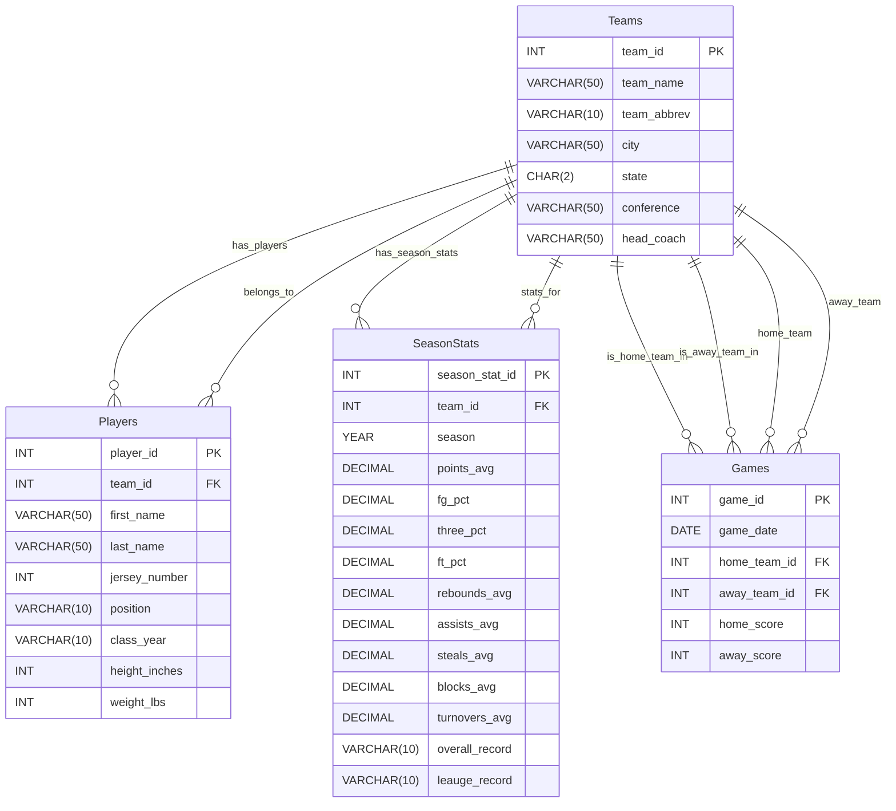

# CS415 Database Project

## Database Summary Report

### Project Overview

This database is designed to model NAIA college basketball teams and show how each team progresses over multiple games, seasons, and rosters. 
The system is organized into four tables: `Teams`, `Players`, `Games`, and `SeasonStats`. Each table stores a small section of data specific to their team. 
Teams represents NAIA college mens basketball teams; Players represents everyone on the teams roster; Games show the results of each head to head matchup;
and SeasonStats shows each teams preformance in different statistical categories over a season. 

I used a fully normalized structure so that each table is stored without repetitive data. Since I decided to not store player names or team names in my Games and SeasonStats tables, 
I was able to reference my data through a forigen key. This made accessing my data a lot easier. It also allowed changes to be a lot easier because I only had to make them in one spot istead of multiple spots. 
For example, last year, Huntington University's head coach was Kory Alford. Since we got a new coach this year, the data would only need to be changed in one spot. 

Another design choice I made was to make a SeasonStats table instead of a TeamStats table. I originally did this and then shortly realized this would require a lot of data. If I were to do this for every team in my database I would have needed to enter over 2400 TeamStats in. 
SeasonStats allows for you to get a glimpse into how the team did over the season. It may prevent you from getting the full picture but statistics are still an important measure of preformance for teams.

`Teams`stores important informtion about each team that helps distingush it from other teams. These fields that are stored are team name, abbreviation, city, state, conference, and head coach. This table is central to the database as it the main reference table for each of the other tables. Each table links back to the Teams table. 

`Players` stores all information about each member of the team including first name, last name, jersey number, position, class year, height, and weight. Each player is part of one team through the `team_id` foreigen key. This table shows important information about each player that helps show how each team functions. 

`Games` stores data for each game played by the crossroads league teams including the game date, the home team, the away tean, and the final score for eeach team. This table uses forigen keys to reference teams rather than storing each team name. This table is important for tracking outcomes and shows important information on head to head matchups. 

`SeasonStats` stores statistical data for each team to represent their whole season including their average points per game, field goal percentage, three point percentage, free throw percentage, rebounds per game, assists per game, steals per game, blocks per game, turnovers per game, and their overall season record. Each row of data will link a team to a specific season. This table is essential to the analysis because it allows you to compare teams by the numbers so you can get a sense for how good or bad the teams are. 


## Database ER Model



## Create Tables

The following SQL creates the 'Teams`,`Players`,`Games`, and `SeasonStats` tables in the current database. 

```sql
-- ==========================================
--TEAMS TABLE
-- Stores information about basketball teams
-- ==========================================

CREATE TABLE Teams (
    team_id INT PRIMARY KEY AUTO_INCREMENT,
    team_name VARCHAR(50),
    team_abbrev VARCHAR(10),
    city VARCHAR(50),
    state CHAR(2),
    conference VARCHAR(50),
    head_coach VARCHAR(50)
);

-- ==========================================
--TEAMS PLAYERS
-- Stores information about a teams roster
-- ==========================================

CREATE TABLE Players (
    player_id INT PRIMARY KEY AUTO_INCREMENT,
    team_id INT,
    first_name VARCHAR(50),
    last_name VARCHAR(50),
    jersey_number INT,
    position ENUM('G', 'F', 'C', 'G/F'),
    class_year ENUM('FR', 'SO', 'JR', 'SR', 'GR', 'RS'),
    height_inches INT,
    weight_lbs INT, 
    FOREIGN KEY (team_id) REFERENCES Teams(team_id)
);

-- ===========================================
--GAMES TABLES
-- Stores head to head matchups between teams
-- ===========================================

CREATE TABLE Games (
    game_id INT PRIMARY KEY AUTO_INCREMENT,
    game_date DATE NOT NULL,
    home_team_id INT NOT NULL,
    away_team_id INT NOT NULL,
    home_score INT NOT NULL,
    away_score INT NOT NULL,
    FOREIGN KEY (home_team_id) REFERENCES Teams(team_id),
    FOREIGN KEY (away_team_id) REFERENCES Teams(team_id)
);

-- ====================================================
--SEASONSTATS TABLES
-- Stores statistics about teams and their preformance
-- ====================================================

CREATE TABLE SeasonStats (
    season_stat_id INT AUTO_INCREMENT PRIMARY KEY,
    team_id INT NOT NULL,
    season YEAR NOT NULL,
    points_avg DECIMAL(5,2),
    fg_pct DECIMAL(5,3),
    three_pct DECIMAL(5,3),
    ft_pct DECIMAL(5,3),
    rebounds_avg DECIMAL(5,2),
    assists_avg DECIMAL(5,2),
    steals_avg DECIMAL(5,2),
    blocks_avg DECIMAL(5,2),
    turnovers_avg DECIMAL(5,2),
    overall_record VARCHAR(10),
    leauge_record VARCHAR(10),
    FOREIGN KEY (team_id) REFERENCES Teams(team_id)
);

```
---

### Insert Data

The following SQL inserts sample data for the
